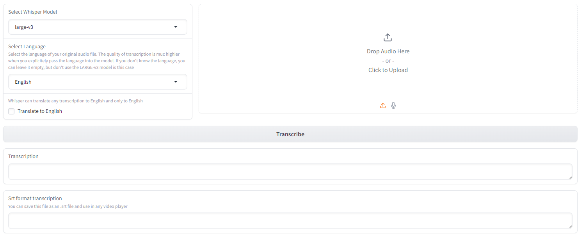

# Whisper locally with Gradio webui
Convert your voice to text easily



## Clone Repo
```
git clone https://github.com/ausboss/whisper-gradio-local.git
cd whisper-gradio-local
```

## Make your environment
```
python -m venv venv
```
## Activate environment

Linux:
```
source venv/bin/activate
```
Windows:
```
venv\Scripts\activate
```

## If you have CUDA-compatible GPU, install CUDA-compatible torch
```
pip install torch torchvision torchaudio --extra-index-url https://download.pytorch.org/whl/cu121
```


## Install requirements
```
pip install -r requirements.txt
```

## Run

```
python main.py
```

You can use available arguments
```
python main.py --listen 127.0.0.1 --port 4715 --share
```
